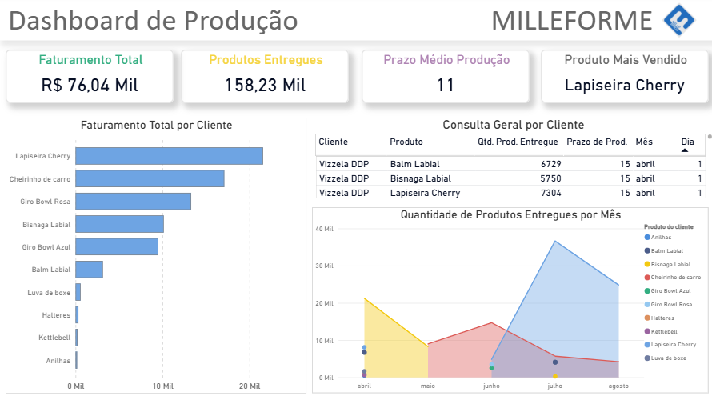

## 📊 Análise de Dados da Produção — Milleforme

### Contexto
Este projeto foi desenvolvido com base em um estudo de caso real, aplicado no time de produção que atualmente eu coordeno. 

A empresa, de perfil tradicional, não possuía um sistema estruturado de coleta e análise de dados do setor de produção — muitas decisões eram tomadas com base em *"achismos"* e percepções isoladas. 

Com isso, tendo em vista que venho me especializando em Data Analitycs, achei interessante implementar uma análise de dados no setor de produção, afim de monitorar melhor o time que eu coordeno, com o intuito de melhorar e otimizar a equipe.

**OBS:** Essa projeto foi aceito pela minha diretoria, sendo uma análise totalmente responsável e coerente. Além disso, aceitaram que fosse criado um conjunto de dados, e me forneceram algmas informações necessários sem quaisquers problema. A publicação desse projeto também foi validada pela diretoria.

### O objetivo principal 
O objetivo principal foi criar uma estrutura de dados confiável e desenvolver um dashboard interativo no Power BI para:
- Identificar gargalos de produção;
- Descobrir quais produtos trazem mais retorno financeiro;
- Avaliar o prazo médio de produção;
- Monitorar o volume produzido por período;
- Apoiar a tomada de decisão baseada em dados.

---

### O que foi feito
1. **Criação do conjunto de dados**
   - Desenvolvi um banco de dados em Excel do zero, registrando dados históricos de produção.
   - Estruturei campos essenciais como: produto, cliente, prazo, quantidade produzida, valor e data de entrega.
   
2. **Modelagem dimensional**
   - Organizei os dados no modelo estrela (*Star Schema*), criando tabelas fato e dimensão.
   - Defini chaves primárias e estrangeiras para relacionamentos no Power BI.

3. **Limpeza e tratamento**
   - Padronização de nomes e categorias;
   - Correção de tipos de dados;
   - Remoção de duplicidades;
   - Criação de colunas e medidas calculadas em DAX para KPIs estratégicos.

4. **Construção do Dashboard**
   - KPIs principais:
     - **Faturamento total**
     - **Quantidade total de produtos entregues**
     - **Prazo médio de produção**
     - **Produto mais vendido em quantidade**
   - Análises gráficas:
     - Faturamento total por cliente e produto
     - Quantidade produzida por mês (sazonalidade)
     - Quantidade produzida por produto ao longo do tempo
   - Interatividade:
     - Filtros dinâmicos
     - Seleção de produto/cliente para atualizar KPIs automaticamente

---

### Resultados e Benefícios
Com este dashboard, agora é possível:
- Tomar decisões mais rápidas e assertivas sobre produção e vendas;
- Identificar produtos estratégicos que geram maior margem;
- Detectar períodos de pico ou baixa produção para planejar melhor a alocação de recursos;
- Estabelecer metas baseadas em dados reais;
- Otimizar o fluxo de produção reduzindo atrasos.

---

### Tecnologias Utilizadas
- **Excel** → Criação e organização do conjunto de dados
- **Power BI** → Modelagem, tratamento, análise e visualização
- **DAX** → Criação de medidas e KPIs
- **Modelo Dimensional** → Estrutura em Estrela (Star Schema)

---

## Demonstração do Dashboard

---

## 📌 Conclusão
Este projeto é um exemplo prático de como a análise de dados aplicada ao ambiente real pode transformar a gestão de um setor.  
Mesmo partindo de um cenário sem histórico estruturado, foi possível:
- Criar uma base sólida de dados;
- Organizar a informação de forma clara;
- Construir indicadores estratégicos;
- Entregar uma ferramenta de apoio à decisão que já está impactando a operação.

---

💡 **Próximos Passos:**
- Adicionar métricas de eficiência de produção.
- Criar alertas automáticos para prazos críticos.

📌 *Projeto desenvolvido por [Anderson Balbino](https://www.linkedin.com/in/anderson-balbino/)*
